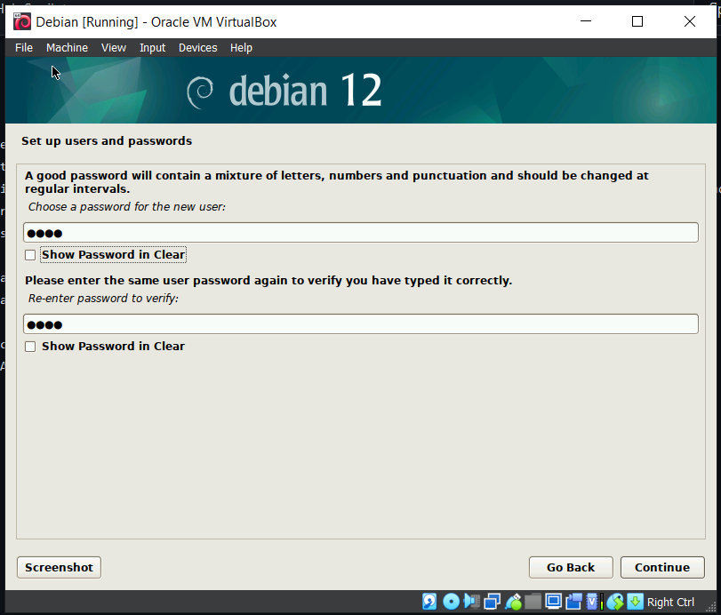

# Tugas Minggu 1

## Instalasi Debian 12

1. Buka Virtual Machine (Disini saya menggunakan Virtual Box)
2. Kemudian klik New untuk membuat Virtual Machine baru (Debian)
3. Lalu akan muncul seperti ini, kemudian pilih file ISO yang sudah di download melalui website debian dan centang pada bagian Skip Unattended Installation.

4. Kemudian tentukan ukuran RAM dan core sesuai kebutuhan.

5. Lalu tentukan size sebesar 25GB (sesuai arahan) untuk virtual Hard Disk.

6. Lalu klik finish.

7. Setelah itu, klik start untuk memulai debiannya.

8. Kemudian akan muncul seperti ini, dan tekan enter pada Graphical Install.

9. Setelah itu pilih bahasa dan lokasi sesuai kebutuhan.

10. Kemudian tentukan acuan zona waktu lalu continue.

11. Setelah itu tentukan hostname (SysAdmin-3122600016) dan untuk domain name dikosongi saja

12. Lalu tentukan password untuk Root, tentukan nama lengkap, nama user, password untuk user, dan zona waktu berdasarkan region

13. Setelah itu tentukan partisi Disk dimana (20 GB untuk root dan bootable on, 5GB untuk Storage dan sisanya untuk swap) lalu klik finish dan pilih option yes

14. Lalu pilih lokasi configuer manager sesuai tempat anda.

15. Lalu pilih software yang perlu diinstall kemudian klik continue dan tunggu hingga proses download selesai

16. Lalu akan muncul option untuk mendownload GRUB, pilih option yes
17. Kemudian pilih /dev/sda
    

18. Kemudian jika sudah akan muncul seperti ini dan instalasipun selesai

